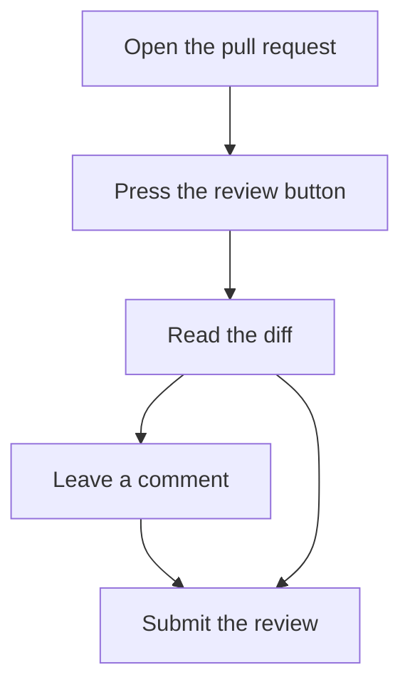
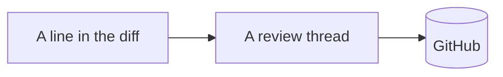

# Reviewing a pull request

This guide covers the review page, the commit picker and the rich diff modes.

## Getting started

1. Open the pull request on GitHub.
2. Press the review button in the corner.
3. Read the diff.



> Markdown is drawn as plain text in the review page today.

```ts
const review = await open(pullRequest);
review.submit({ event: 'APPROVE' });
```

## Where a comment goes



See [the design](../README.md) for the reasoning.
